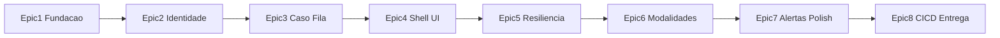

# Plano Incremental — Limen (8IADT Fase 4)

Produto: **Limen**. Glossário: [`CONTEXT.md`](CONTEXT.md). ADRs: [`docs/adr/`](docs/adr/) (0001–0028).

> Protótipo acadêmico — **não** é dispositivo médico.

## Método de entrega

| Conceito | Definição |
|----------|-----------|
| **Épico** | Tema (ex.: Fundação, Shell Frontend) |
| **Etapa** | Entrega demonstrável com DoD claro; N tarefas internas |
| **Fatia** | Vertical: cada etapa mostra valor (API e/ou UI), não só camada |

**SDD:** specs em Markdown em `specs/epic-XX/` com Given/When/Then **antes** do código.  
**TDD:** teste vermelho → implementação → verde (pytest; Testing Library nas features críticas de UI).  
**Contratos:** Pydantic ↔ types TS (leves); contract tests formais depois que a API estabilizar.  
**Specs finas de 6–8:** escritas no início de cada épico (mesmo padrão), não todas upfront.

## Datasets (catálogo canônico + quando entra)

Estratégia: **fixtures/samples versionados no repo** para runtime, TDD e demo; **datasets públicos** para calibração, EDA, figuras e evidência no relatório (sem download obrigatório no CI). Brutos grandes em `.gitignore`; documentar URL + como regenerar fixtures.

### URLs / slugs canônicos

| Papel | Dataset | URL |
|-------|---------|-----|
| Vitais (CSV Kaggle, primário) | Human vital signs | https://www.kaggle.com/datasets/engrarri21/human-vital-signs |
| Vitais / eventos (Kaggle) | Patient Vital Signs and Event Tracking | https://www.kaggle.com/datasets/parmajha/patient-vital-signs-and-event-tracking |
| Deterioração | Hospital Deterioration | https://www.kaggle.com/datasets/tarekmasryo/hospital-deterioration-dataset · https://huggingface.co/datasets/tarekmasryo/hospital-deterioration-dataset · https://github.com/tarekmasryo/hospital-deterioration-dataset |
| PhysioNet (PDF / relatório) | Challenge 2019 e/ou MC-MED | https://physionet.org/content/challenge-2019/ · https://physionet.org/content/mc-med/1.0.0/ |
| Áudio (demo STT) | Medical Speech, Transcription and Intent | https://www.kaggle.com/datasets/paultimothymooney/medical-speech-transcription-and-intent |
| Áudio (PDF / referência) | AudioSet | https://research.google.com/audioset/ |
| Vídeo fisio | 3DYoga90 (ou gravação própria 30–60s) | https://github.com/seonokkim/3dyoga90 |
| Vídeo cirurgia leve | Stock CC (sem dataset de sangramento) | fonte CC documentada no README |
| Prescrições | Sintético Limen | `data/fixtures/prescriptions/` |

### Consumo extensivo por etapa

| Momento | Entrega |
|---------|---------|
| **Pré-E3 / E3.0** | Spec datasets vitais; EDA + calibração com `human-vital-signs` + `hospital-deterioration-dataset` (+ opcional event-tracking); `data/fixtures/vitals/`; notebook inicial |
| **E3.2** | AnomalyEngine + Casos de teste só com fixtures calibradas |
| **E6** | `data/samples/`: clip 3DYoga90 ou gravação; stock cirurgia; 1–3 utterances medical-speech ≤60s; AudioSet citado |
| **E8** | Notebooks finais; capítulo de datasets no relatório (incl. PhysioNet); seed completo |

Layout: `data/fixtures/`, `data/samples/`, `notebooks/`, `scripts/calibrate_vitals.py`.

## Ordem dos épicos

1. Fundação  
2. Identidade e privacidade  
3. Núcleo Caso + fila (vitais → Risco + Alerta v1)  
4. **Shell Frontend** (cedo — especialidade)  
5. Resiliência operacional  
6. Modalidades PDF (vídeo → áudio → prescrições)  
7. Alertas + polish UI (estrelas da demo + a11y + Lighthouse gate)  
8. CI/CD e entrega  

CI magro desde o Épico 1; publish GHCR + smoke Compose + Lighthouse budget no 7/8.

---

## Épico 1 — Fundação (concluído)

**E1.1 Compose + health + bootstrap**

| ID | Tarefa | Status |
|----|--------|--------|
| T1.0 | Spec `specs/epic-01-foundation/01-compose-health.md` | Concluída |
| T1.1 | Skeleton FastAPI + teste vermelho `/health` | Concluída |
| T1.2 | `/health` checa Postgres, Redis, MinIO | Concluída |
| T1.3 | `docker-compose.yml` (postgres, redis, minio, backend) | Concluída |
| T1.3b | Bootstrap MinIO: bucket `limen` | Concluída |
| T1.3c | Alembic + migration inicial; entrypoint migra | Concluída |
| T1.4 | `.env.example` + README mínimo | Concluída |
| T1.5 | Smoke local health | Concluída |
| T1.6 | CI magro: pytest (+ lint placeholder) | Concluída |

**DoD validado:** `compose up` → health 200; bucket existe; migrations ok; CI verde.

---

## Épico 2 — Identidade e privacidade (concluído)

**E2.1 Auth**

| ID | Tarefa |
|----|--------|
| T2.0 | Spec `01-auth-login.md` (**concluída**) |
| T2.1–2.4 | TDD JWT access curto + refresh + logout; rate limit; seed (**concluída**) |

**E2.2 Paciente**

| ID | Tarefa |
|----|--------|
| T2.5 | Spec `02-paciente-privacidade.md` (**concluída**) |
| T2.6 | TDD CRUD Paciente + migração `patients` (**concluída**) |
| T2.7 | TDD rótulo Fernet + `PII_ENCRYPTION_KEY` (**concluída**) |
| T2.8 | TDD reveal + Registro de Auditoria (**concluída**) |
| T2.9 | Stub `cases` + FK `ON DELETE CASCADE` (**concluída**) |
| T2.10 | Fechamento E2.2 / DoD Paciente (**concluída**) |

**DoD validado:** login/refresh/logout; Paciente mascarado; audit de reveal;
cascade no schema (`audit_records` + stub `cases`).

---

## Épico 3 — Núcleo Caso + fila (tarefas)

**E3.0 Dados vitais (pré / início)** Spec datasets vitais; calibração Kaggle Vital Signs + Hospital Deterioration; gerar `data/fixtures/vitals/`; notebook EDA inicial.  
**E3.1** Spec + TDD outbox Postgres → RQ `default` + worker + reconciler básico.  
**E3.2** Spec + TDD Caso (≥1 modalidade, Paciente, idempotency); fixtures calibradas → AnomalyEngine → Fusion; Artefato MinIO; **Alerta v1 persistido** se Risco ≥ MEDIO (sem SSE).

**DoD:** fixtures versionadas documentadas; POST Caso vitais → `done` + Risco (+ Alerta se limiar); job na fila.

---

## Épico 4 — Shell Frontend (tarefas)

**E4.1** Spec + Next/shadcn/Tailwind; Zustand sessão (access/refresh); `/login` + shell landmarks responsivo; proxy `/api`; testes login.  
**E4.2** Spec + Pacientes, Novo Caso vitais, detalhe + polling/skeletons; Risco/Alerta read-only.  
**E4.3** Baseline Lighthouse (`docs/perf/baseline/`), sem gate.

**DoD:** fluxo visual Paciente → Caso → Risco; baseline versionada.

**Fora:** dark mode, AA fino, Justificativa rica, SSE, admin DLQ, Recharts.

---

## Épico 5 — Resiliência (tarefas)

**E5.1** Spec + TDD status por modalidade; falha parcial; reprocess seletivo; refundição; Alerta v2 se limiar mudar.  
**E5.2** Spec + TDD filas `video`/`default`; retries classificados; timeouts RQ; DLQ + `/admin/failures` (redrive/discard + audit); CB stub; 403 para `medico`.

**DoD:** falha forçada → DLQ API → redrive; Caso parcial `done`.

---

## Épico 6 — Modalidades PDF (etapas)

| Etapa | DoD |
|-------|-----|
| E6.1 Vídeo | Samples de yoga/HAR ou gravação + stock cirurgia leve; Pose + YOLO; fila `video`; frames no MinIO |
| E6.2 Áudio | Sample AudioSet/speech ≤60s; Azure F0 + cache + fallback + CB; badge provider |
| E6.3 Prescrições | Regras + histórico; CSV sintético seed; Casos demo multimodais |

Specs finas criadas no início de cada etapa.

---

## Épico 7 — Alertas + polish UI (etapas)

| Etapa | DoD |
|-------|-----|
| E7.1 | Justificativa template; Alertas versionados; SSE `fetch`+Bearer |
| E7.2 | Telas estrela (Caso 70% + Paciente/Alertas): dark/light; WCAG 2.2 AA; toast `polite` + região Alertas navegável; upload acessível; reveal rótulo+SR; Recharts lazy; admin DLQ UI |
| E7.3 | Lighthouse CI: Perf ≥90, A11y ≥95, BP ≥90; **gate por regressão** vs baseline |

---

## Épico 8 — CI/CD e entrega (etapas)

| Etapa | DoD |
|-------|-----|
| E8.1 | Publish GHCR só `main`; smoke Compose + Caso vitais (`AZURE_ENABLED=false`) |
| E8.2 | Seed demo; notebooks finais; relatório com capítulo de datasets (Kaggle, Hospital Deterioration, PhysioNet, AudioSet); roteiro vídeo; README |

---

## Frontend (diferencial) — resumo

- Estrelas da demo: **Caso** + fecho Paciente/Alertas  
- Shell cedo (épico 4); polish a11y/tema/SSE (épico 7)  
- Semântica/landmarks desde o 4; dark mode + AA fino no 7  
- Features: Justificativa, upload acessível, desmascarar+audit+SR  
- Performance: Recharts lazy; Lighthouse progressivo  

## Arquitetura (âncora)

Stack e diagramas canônicos permanecem: FastAPI + RQ + Postgres + Redis + MinIO + Next; Azure F0; outbox; falha parcial; etc. (ADRs 0001–0028).

## Próximo passo de execução

O **Épico 1** e o **Épico 2 — Identidade e privacidade** estão concluídos.
Próximo: **Épico 3 — Núcleo Caso + fila** (começar por E3.0 / spec de datasets
vitais).
