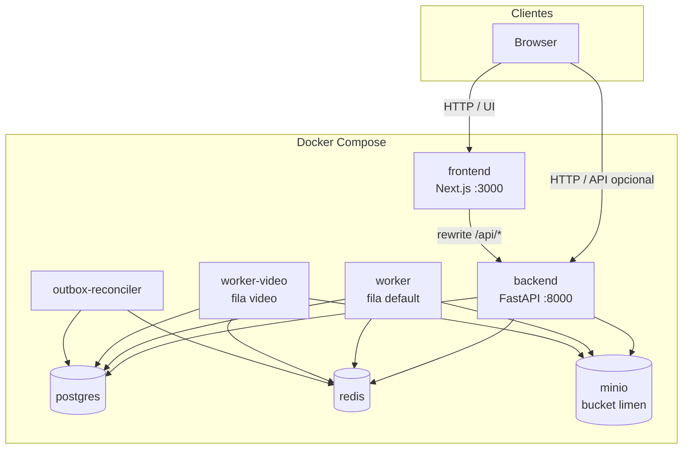
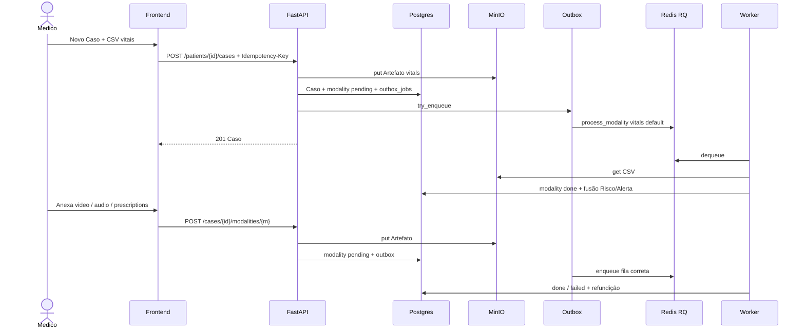
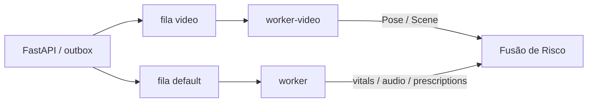
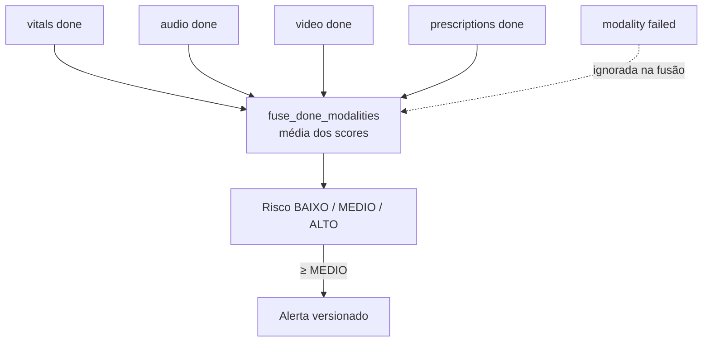
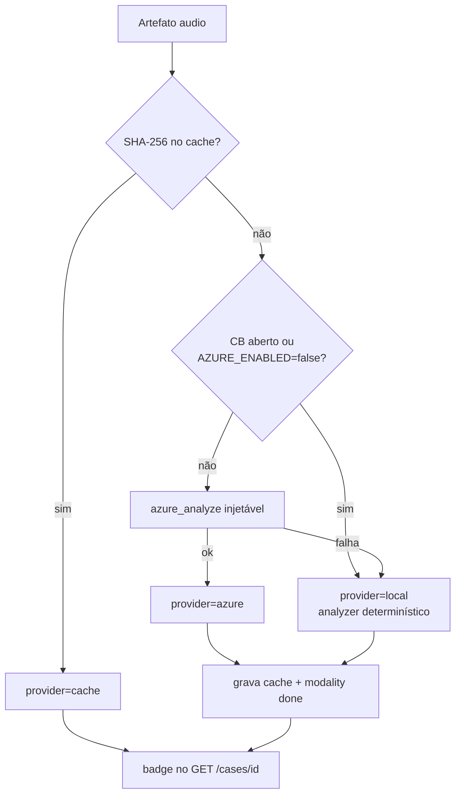
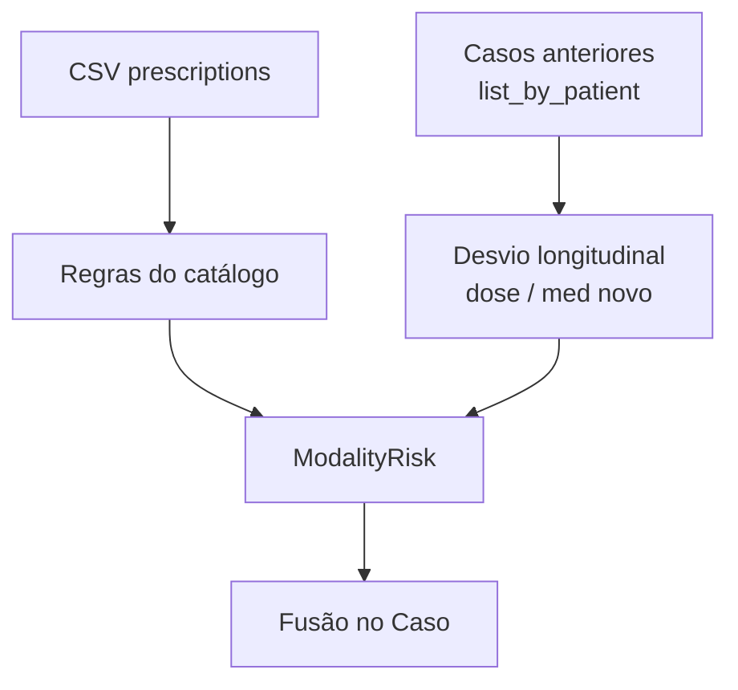
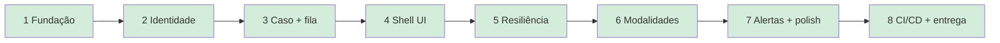

# Arquitetura do Limen

Visão atual da stack após os **Épicos 1–6** (Fundação → Modalidades PDF).
Decisões numeradas vivem em [`adr/`](adr/); glossário em [`../CONTEXT.md`](../CONTEXT.md).

> O Limen é um protótipo acadêmico e **não** é um dispositivo médico.

## Conteúdo

1. [Containers (Compose)](#1-containers-compose)
2. [Fluxo de um Caso multimodal](#2-fluxo-de-um-caso-multimodal)
3. [Filas RQ (`default` / `video`)](#3-filas-rq-default--video)
4. [Fusão de Risco e falha parcial](#4-fusão-de-risco-e-falha-parcial)
5. [Provedor de Áudio (Azure F0)](#5-provedor-de-áudio-azure-f0)
6. [Prescrições (regras + histórico)](#6-prescrições-regras--histórico)
7. [Mapa de épicos](#7-mapa-de-épicos)

---

## 1. Containers (Compose)

Stack local: Next.js (UI) → FastAPI (API) → Postgres / Redis / MinIO; workers RQ
e reconciler de outbox.

| Serviço | Papel |
| ------- | ----- |
| `frontend` | Shell Next (App Router); proxy `/api` → backend |
| `backend` | Auth JWT, Pacientes, Casos, upload de modalidades, admin DLQ |
| `worker` | Jobs `process_modality` nas filas leves (`default`) |
| `worker-video` | Jobs de `video` (CPU-heavy) |
| `outbox-reconciler` | Reenfileira outbox pendente (ADR 0016) |
| `postgres` | Domínio (Casos, Artefatos, Alertas, outbox, …) |
| `redis` | Broker RQ |
| `minio` | Blobs de Artefato (CSV, AVI, WAV, frames) |

---

## 2. Fluxo de um Caso multimodal

Criação com vitais e anexos posteriores (vídeo / áudio / prescriptions) usam
`Idempotency-Key`, gravam Artefato no MinIO e publicam job via outbox.

Modalidades suportadas hoje: `vitals`, `video`, `audio`, `prescriptions`.

Seed demo in-memory (quatro modalidades, keys fixas):
[`../scripts/seed_multimodal_demo.py`](../scripts/seed_multimodal_demo.py).

---

## 3. Filas RQ (`default` / `video`)

Isolamento de carga (ADR 0020): vídeo não monopoliza vitais/áudio/prescrições.

| Modalidade | Fila | Timeout padrão |
| ---------- | ---- | -------------- |
| `vitals` | `default` | 30s |
| `audio` | `default` | 90s |
| `prescriptions` | `default` | 30s |
| `video` | `video` | 180s |

Timeouts configuráveis via `LIMEN_TIMEOUT_*_SECONDS` (ADR 0017).

---

## 4. Fusão de Risco e falha parcial

Cada modalidade termina em `done` / `failed` / `skipped`. O Caso pode fechar
`done` com falha parcial; a fusão só considera modalidades `done` (ADR 0013).

Reprocessamento seletivo: `POST /cases/{id}/reprocess` reenfileira só
`failed` e refundiciona.

---

## 5. Provedor de Áudio (Azure F0)

Resolução efetiva `azure` \| `local` \| `cache` (CONTEXT + ADR 0015). Cache
in-process por SHA-256 do payload; circuit breaker força `local` sem rede.

CI/demo: `AZURE_ENABLED=false` (sem Azure real obrigatório).

---

## 6. Prescrições (regras + histórico)

Engine local (ADR 0010): dose / intervalo / medicamento inesperado + desvio
longitudinal vs. Casos anteriores do mesmo Paciente com `prescriptions` `done`.

Fixtures: [`../data/fixtures/prescriptions/`](../data/fixtures/prescriptions/).

---

## 7. Mapa de épicos

| Épico | Status |
| ----- | ------ |
| 1–8 | Concluídos |

---

## Referências rápidas

| Documento | Conteúdo |
| --------- | -------- |
| [`README.md`](../README.md) | Operação local, curls, env |
| [`adr/`](adr/) | Decisões (0001–0028) |
| [`../specs/`](../specs/) | Contratos SDD por épico |
| [`../CONTEXT.md`](../CONTEXT.md) | Linguagem ubíqua |
| [`frontend/guia-de-uso.md`](frontend/guia-de-uso.md) | UI (Épico 4) |
