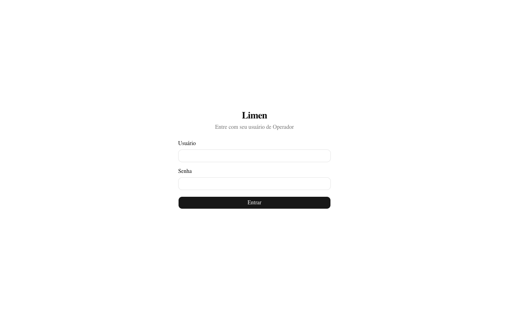
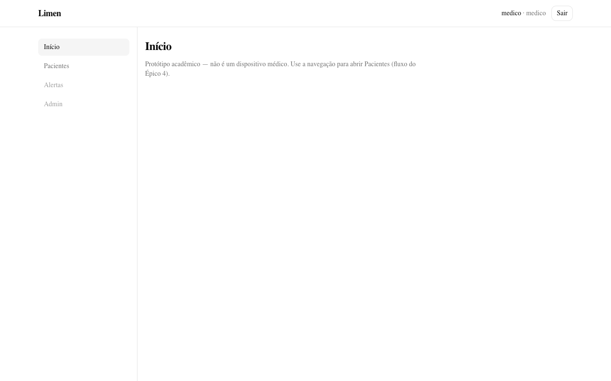
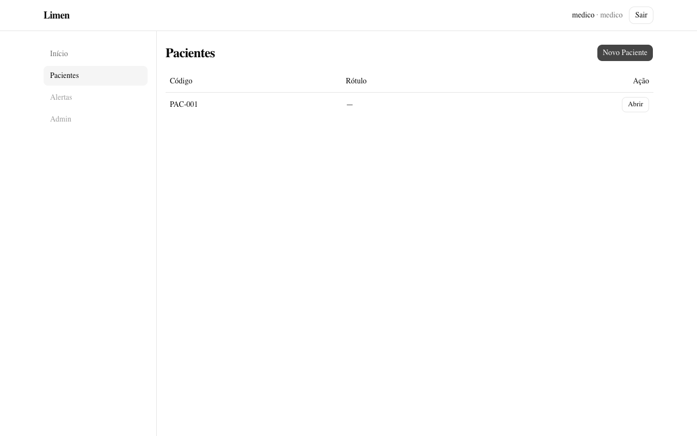
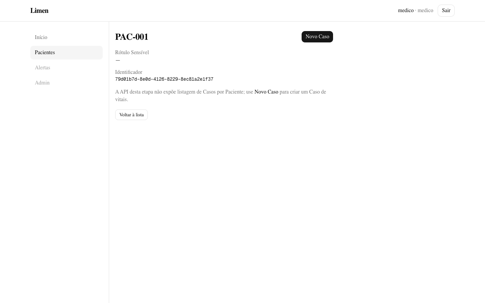
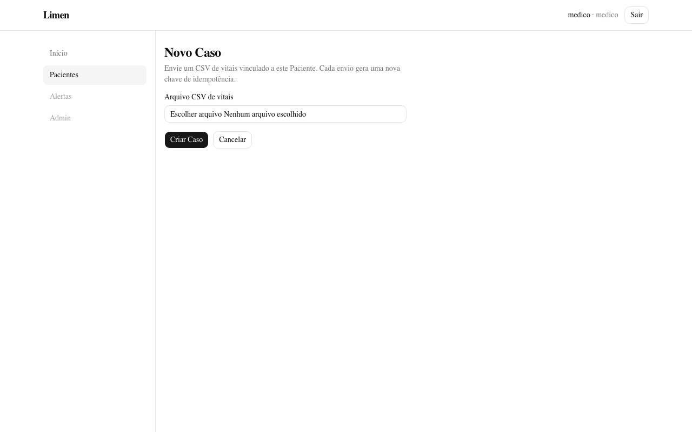
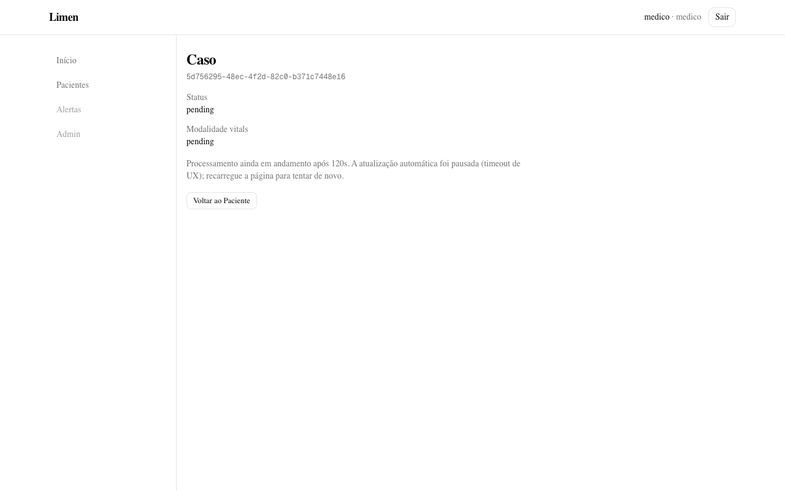

# Guia de uso — Frontend Limen

Documentação operacional e visual do shell Next.js: login, Pacientes, Novo Caso,
detalhe de Caso (Risco/Justificativa/Alertas), `/alertas`, tema dark/light e
painel admin de Falhas (E7.1–E7.2).

> O Limen é um **protótipo acadêmico** e **não é um dispositivo médico**. Não use
> para decisões clínicas reais.

## Índice

1. [Pré-requisitos](#pré-requisitos)
2. [Subir a aplicação](#subir-a-aplicação)
3. [Credenciais demo](#credenciais-demo)
4. [Mapa de rotas](#mapa-de-rotas)
5. [Fluxo guiado (com prints)](#fluxo-guiado-com-prints)
6. [Arquitetura da UI (resumo)](#arquitetura-da-ui-resumo)
7. [Fixtures de vitais](#fixtures-de-vitais)
8. [Regenerar prints](#regenerar-prints)
9. [Troubleshooting](troubleshooting.md)

## Pré-requisitos

| Item | Notas |
| ---- | ----- |
| Docker Desktop / Engine + Compose v2 | Portas livres: 3000, 5432, 6379, 8000, 9000, 9001 |
| Git | Clonar este repositório |
| (Opcional) Node 22+ | Só se for regenerar prints ou rodar `npm` fora do Compose |

## Subir a aplicação

Na raiz do repositório:

```bash
./scripts/start-limen.sh
```

O script:

1. Cria `.env` a partir de `.env.example` se ainda não existir
2. Executa `docker compose up -d --build --wait`
3. Valida API (`/health`), proxy da UI (`/api/health`) e `/login`
4. Imprime as URLs e as credenciais demo

Variantes:

```bash
./scripts/start-limen.sh --smoke   # sobe + smoke da fundação
./scripts/start-limen.sh --down    # encerra (mantém volumes)
./scripts/start-limen.sh --reset   # encerra e apaga Postgres/MinIO
```

URLs após o start:

| Recurso | URL |
| ------- | --- |
| UI | <http://localhost:3000> |
| Login | <http://localhost:3000/login> |
| API | <http://localhost:8000> |
| OpenAPI | <http://localhost:8000/docs> |
| MinIO Console | <http://localhost:9001> |

## Credenciais demo

Definidas no `.env` (valores padrão do `.env.example`):

| Papel | Usuário | Senha |
| ----- | ------- | ----- |
| Médico | `medico` | `medico_dev_only` |
| Admin | `admin` | `admin_dev_only` |

Neste épico, `medico` e `admin` compartilham as telas clínicas; só `admin` vê
e opera `/admin/falhas` (API retorna 403 para `medico`).

## Mapa de rotas

| Rota | Auth | Função |
| ---- | ---- | ------ |
| `/login` | pública | Formulário de login + toggle de tema |
| `/` | autenticada | Início (shell) |
| `/pacientes` | autenticada | Lista + criar Paciente mínimo |
| `/pacientes/[id]` | autenticada | Detalhe, reveal SR, tendência lazy |
| `/pacientes/[id]/novo-caso` | autenticada | Upload CSV de vitais (a11y) |
| `/casos/[id]` | autenticada | Status, Risco, Justificativa, uploads, gráficos |
| `/alertas` | autenticada | Feed SSE da sessão (lista navegável) |
| `/admin/falhas` | autenticada (`admin`) | DLQ: listar, redrive, discard |

Nav: **Início**, **Pacientes**, **Alertas**; **Falhas** só para papel `admin`.

## Fluxo guiado (com prints)

Os arquivos em [`images/`](images/) são capturas reais do shell. Se a pasta
estiver vazia no seu clone, regenere com a seção [Regenerar prints](#regenerar-prints).

### 1. Login

Abra <http://localhost:3000/login> (ou qualquer rota autenticada — o guard
redireciona para o login).



1. Informe usuário e senha demo (`medico` / `medico_dev_only`)
2. Clique em **Entrar**
3. Em sucesso, a sessão (access + refresh) fica no Zustand (`limen-session` no
   `localStorage`) e você vai para `/`

Erros comuns: credenciais inválidas; rate limit (`5/minute` no `.env`); backend
fora do ar (veja [troubleshooting](troubleshooting.md)).

### 2. Shell (Início)



- Header com landmarks (`banner` / navegação / `main`)
- Username e papel do Operador
- Toggle dark/light (persistente em `limen-theme`)
- Toast polite de Alertas (SSE) + indicador de feed
- Logout
- Nav: **Início**, **Pacientes**, **Alertas**; **Falhas** se `admin`
- Em viewport estreita, o menu colapsa (botão com `aria-expanded`)

### 3. Lista de Pacientes

Navegue para **Pacientes** ou <http://localhost:3000/pacientes>.



- Tabela com código `PAC-NNN` e rótulo mascarado (ou `—`)
- **Novo Paciente** chama `POST /api/patients` (sem campos extras)
- **Abrir** leva ao detalhe

### 4. Detalhe do Paciente



- Código e Rótulo Sensível mascarado; **Revelar rótulo** (confirmação + audit) e
  **Remascarar** com anúncio `aria-live` para leitores de tela
- Tendência de Risco (Recharts lazy; empty state até existir histórico na API)
- Atalhos para **Alertas** e **Novo Caso**
- A API ainda **não** lista Casos por Paciente; a lacuna está documentada na tela

### 5. Novo Caso (upload de vitais)



1. Selecione um CSV de vitais (use as fixtures em `data/fixtures/vitals/`)
2. Clique em **Criar Caso** (erros associados ao controle via `aria-describedby`)
3. O cliente gera uma `Idempotency-Key` nova a cada tentativa de submit
4. Em sucesso (201 ou replay 200), a UI navega para `/casos/{id}`

### 6. Detalhe do Caso (polling → Risco)



Enquanto o status for `pending` ou `processing`:

- A UI faz polling a cada **2s**
- Exibe skeleton / “Processando Caso…”
- Após **120s** sem estado terminal, **pausa o polling** (timeout de UX) e
  sugere recarregar a página — como no print acima

Quando o worker concluir com `done`:

- Mostra `risk_score` e `risk_level` (`BAIXO` / `MEDIO` / `ALTO`)
- Lista Alertas (`level` + `version`) se existirem
- Seção **Justificativa** (narrativa template + contribuições por modalidade)
  quando o Caso está `done` e o backend enviou `justification`
- Gráfico lazy de scores parciais por modalidade (Recharts)
- Uploads acessíveis de modalidades ainda ausentes (video / áudio / prescriptions)
- Toast polite no shell quando o SSE emite `alert.created` / `alert.updated`
- Se `BAIXO`, a seção de Alertas aparece vazia (“Nenhum Alerta”)

Se `failed`, a UI mostra aviso de falha; o painel DLQ está em `/admin/falhas`
(somente `admin`).

### 7. Alertas (`/alertas`)

Feed efêmero dos eventos SSE recebidos nesta sessão: landmark, heading e lista
de links focáveis para `/casos/[id]`.

### 8. Falhas de Processamento (`/admin/falhas`)

Só `admin`. Lista falhas abertas, inspeciona `error_summary`, **Redrive** ou
**Descartar**. `medico` vê bloqueio explícito na UI (API 403).

Se o Caso permanecer em `pending` após o timeout, veja
[troubleshooting — Caso não sai de pending](troubleshooting.md#7-caso-não-sai-de-pendingprocessing).

## Arquitetura da UI (resumo)

| Camada | Tecnologia | Papel |
| ------ | ---------- | ----- |
| App Router | Next.js 15 | Rotas e layout |
| Estilo | Tailwind + shadcn/ui | Componentes; tema dark via `.dark` |
| Sessão / UI prefs | Zustand + persist | JWT + tema (`limen-theme`) |
| Server state | TanStack Query | Pacientes / Casos / Falhas + polling |
| Gráficos | Recharts + `next/dynamic` | Só Caso/Paciente (ADR 0027) |
| Proxy | `next.config` rewrite `/api/*` | Encaminha ao FastAPI (`BACKEND_URL`) |

ADRs: [0023](../adr/0023-frontend-nextjs.md), [0024](../adr/0024-ui-tailwind-shadcn.md),
[0025](../adr/0025-estado-query-zustand.md), [0026](../adr/0026-rotas-frontend.md),
[0027](../adr/0027-graficos-recharts-lazy.md), [0003](../adr/0003-painel-dlq-redrive.md).

Baseline Lighthouse (sem gate): [`../perf/baseline/`](../perf/baseline/).

## Fixtures de vitais

| Arquivo | Expectativa típica após o worker |
| ------- | -------------------------------- |
| `data/fixtures/vitals/vitals_normal.csv` | `BAIXO`, sem Alerta |
| `data/fixtures/vitals/vitals_medium.csv` | `MEDIO`, Alerta v1 |
| `data/fixtures/vitals/vitals_high.csv` | `ALTO`, Alerta v1 |

O processamento depende do `worker` RQ e do `outbox-reconciler` no Compose.

## Regenerar prints

Com a stack no ar:

```bash
./scripts/start-limen.sh
node docs/frontend/scripts/capture-screenshots.mjs
```

Saída em `docs/frontend/images/01-login.png` … `06-caso-detalhe.png`.

Requer Chrome/Chromium e as devDependencies do frontend (`puppeteer-core`,
`chrome-launcher`).
