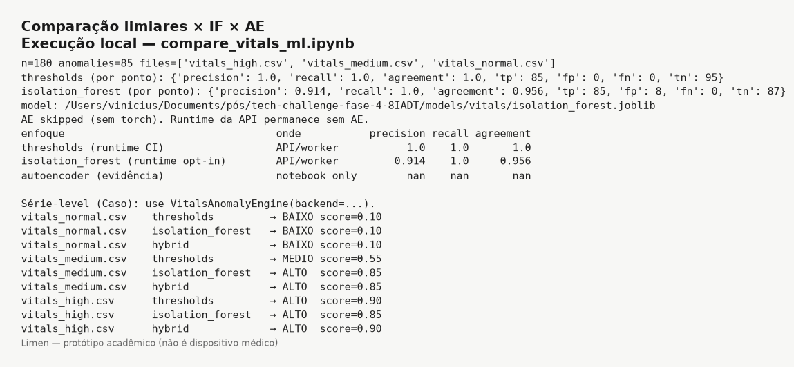
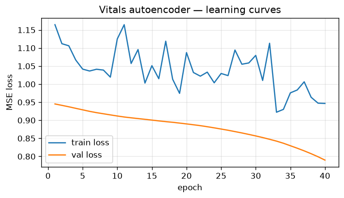

# Relatório — Limen (FIAP 8IADT Fase 4)

> **Disclaimer:** o Limen é um **protótipo acadêmico** e **não** é um dispositivo
> médico. Não deve ser usado para decisões clínicas reais.

**Produto:** Limen (limiar) — análise multimodal para detecção precoce de risco
clínico a partir de vitais, vídeo, áudio e prescrições sintéticas.  
**Equipe / disciplina:** FIAP 8IADT — Tech Challenge Fase 4.  
**Repositório:** código, specs SDD e ADRs versionados neste Git.

## 1. Objetivo e escopo

Entregar um protótipo full-stack (API FastAPI + workers RQ + Postgres/Redis/MinIO
+ frontend Next.js) capaz de:

1. Autenticar Operadores (`medico` / `admin`) com JWT.
2. Gerir Pacientes com Rótulo Sensível mascarado e auditoria de reveal.
3. Criar Casos multimodais, processar modalidades de forma assíncrona (outbox →
   fila), fundir Risco (BAIXO/MEDIO/ALTO) e versionar Alertas.
4. Expor Justificativa template, SSE de Alertas, UI acessível (WCAG 2.2 AA nas
   rotas estrela) e painel admin de Falhas (DLQ).
5. Validar entrega com CI (pytest, Lighthouse, imagens GHCR, smoke Compose de
   Caso vitais) e seed demo multimodal.

Fora do escopo fechado: dispositivo médico, PHI real, E2E Playwright, deploy
cloud automático, Azure Speech obrigatório no CI, LLM para Justificativa.

## 2. Arquitetura (resumo)

Stack Compose: Postgres (domínio), Redis (RQ), MinIO (Artefatos), backend
FastAPI, workers `default` / `video`, reconciler de outbox, frontend Next.

Diagramas canônicos: [`architecture.md`](architecture.md).  
ADRs: [`README.md`](README.md) (índice). Glossário: [`../CONTEXT.md`](../CONTEXT.md).

Decisões âncora: vitais sintéticos em runtime (ADR 0008); outbox leve (0016);
falha parcial / reprocess (0013); filas separadas para vídeo (0020); SSE via
`fetch`+Bearer (0022); CI/CD + GHCR só em `main` (0028).

## 3. Épicos entregues

| Épico | Tema | Resultado |
| ----- | ---- | --------- |
| 1 | Fundação | Compose, health, bootstrap MinIO/Alembic |
| 2 | Identidade | Auth JWT, Paciente, Rótulo Sensível |
| 3 | Caso + fila | Vitais → AnomalyEngine → Risco/Alerta v1 |
| 4 | Shell UI | Next.js, login, Pacientes/Caso |
| 5 | Resiliência | Falha parcial, DLQ, retries, timeouts |
| 6 | Modalidades | Vídeo (pose/YOLO), áudio Azure F0/local, prescriptions + seed |
| 7 | Alertas + polish | Justificativa, SSE, a11y/tema, Lighthouse gate |
| 8 | CI/CD + entrega | GHCR, smoke vitais, seed HTTP, notebooks, este relatório |
| 9 | Vitais ML | ETL offline, Isolation Forest opt-in, AE PyTorch só evidência |
| 10 | Áudio Azure real | Speech + Language opt-in; CI com `AZURE_ENABLED=false` |
| 11 | Vídeo real | YOLOv8 + MediaPipe opt-in; CI sintético |

## 4. Privacidade e segurança

- Sem PHI real: Código do Paciente (`PAC-NNN`), Rótulo Sensível criptografado
  (Fernet / `PII_ENCRYPTION_KEY`).
- Rate limit no login; JWT com TTL curto; auditoria de reveal e ações de DLQ.
- Secrets só em `.env` (exemplo em `.env.example`); nunca commitados.

## 5. Capítulo de datasets

Estratégia: **fixtures/samples versionados** no Git para runtime, TDD e demo;
**datasets públicos** só para calibração, EDA, figuras e evidência neste
relatório. Brutos grandes ficam em `data/raw/` (`.gitignore`). O CI **não**
baixa Kaggle/PhysioNet/AudioSet.

### 5.1 O que é runtime vs referência

| Tipo | Onde | Papel |
| ---- | ---- | ----- |
| Fixture sintética | `data/fixtures/{vitals,video,audio,prescriptions}/` | Runtime, TDD, smoke, seed |
| Sample / evidência | notebooks + READMEs das fixtures | Calibração documentada |
| Dataset público | URLs abaixo | Referência metodológica — **sem** dependência de execução |

### 5.2 Catálogo canônico

| Papel | Dataset | URL | Uso no Limen |
| ----- | ------- | --- | ------------ |
| Vitais (Kaggle) | Human vital signs | https://www.kaggle.com/datasets/engrarri21/human-vital-signs | Calibração de faixas; fixtures `vitals_*.csv` |
| Vitais / eventos | Patient Vital Signs and Event Tracking | https://www.kaggle.com/datasets/parmajha/patient-vital-signs-and-event-tracking | Referência opcional de eventos |
| Deterioração | Hospital Deterioration | https://www.kaggle.com/datasets/tarekmasryo/hospital-deterioration-dataset · HuggingFace · GitHub | Calibração de anomalias / Risco |
| PhysioNet | Challenge 2019 · MC-MED | https://physionet.org/content/challenge-2019/ · https://physionet.org/content/mc-med/1.0.0/ | Referência metodológica no PDF/relatório — **sem runtime** |
| Áudio (ref.) | AudioSet | https://research.google.com/audioset/ | Referência de classes/ambientação |
| Áudio (demo) | Medical Speech, Transcription and Intent | https://www.kaggle.com/datasets/paultimothymooney/medical-speech-transcription-and-intent | Citação; fixture WAV sintética ≤60s em runtime |
| Vídeo fisio | 3DYoga90 | https://github.com/seonokkim/3dyoga90 | Citação; AVI sintético `video_physio.avi` em runtime |
| Vídeo cirurgia leve | Stock CC / CC0 | Bancos CC0 (ex. Pexels/Pixabay) — URL escolhida documentada nos READMEs | Proxy visual; **sem** dataset de sangramento |
| Prescrições | Sintético Limen | `data/fixtures/prescriptions/` | Regras + desvio longitudinal |

Notebooks de evidência: [`../notebooks/`](../notebooks/)
(`eda_vitals_final.ipynb`, `evidencia_modalidades.ipynb`,
`train_vitals_autoencoder.ipynb`, `compare_vitals_ml.ipynb`).

Regeneração de fixtures: `scripts/calibrate_vitals.py`,
`prepare_video_fixtures.py`, `prepare_audio_fixtures.py`,
`prepare_prescription_fixtures.py`.

ETL offline (Épico 9): `scripts/etl_vitals_datasets.py` lê brutos opcionais em
`data/raw/` (Kaggle Human vital signs + Hospital Deterioration) e gera
`data/processed/vitals/` — **sem** download no CI/API. PhysioNet permanece
citação metodológica ([ADR 0029](adr/0029-vitais-ml-hibrido.md)).

### 5.3 Vitais ML (Épico 9 / ADR 0029)

| Trilho | Flag / artefato | Papel |
| ------ | --------------- | ----- |
| Limiares | `LIMEN_VITALS_BACKEND=thresholds` (default CI) | Comportamento histórico HR/SpO2 |
| Isolation Forest | `isolation_forest` ou `hybrid` + `models/vitals/isolation_forest.joblib` | Runtime sklearn/joblib |
| Autoencoder PyTorch | notebook `train_vitals_autoencoder.ipynb` | **Só evidência** — **não** entra no worker/API |

- `hybrid` = limiares **OU** IF (mais sensível; recomendado na demo local).
- CI/smoke continuam em `thresholds` e **não** baixam datasets.
- Comparação quantitativa (precision/recall/agreement) nas fixtures:
  [`../notebooks/compare_vitals_ml.ipynb`](../notebooks/compare_vitals_ml.ipynb).
- Limite clínico: escores são demonstração acadêmica — **não** validação
  clínica nem dispositivo médico.

Evidência visual (Épico 12 — prints locais, fora do CI):

## 6. Modalidades e fusão de Risco

- **Vitais:** `VitalsAnomalyEngine` com backends `thresholds` /
  `isolation_forest` / `hybrid` (ADR 0029); AE só no notebook.
- **Vídeo:** Análise Postural (MediaPipe/synthetic) + Detecção em Cena
  (YOLO/synthetic); fila `video`.
- **Áudio:** Provedor Azure F0 com CB/fallback local; cache; `AZURE_ENABLED=false`
  no CI/demo.
- **Prescriptions:** regras + desvio longitudinal.
- Fusão renormaliza pesos das modalidades `done`; falha parcial permite Caso
  `done` com modalidades `failed`.

## 7. Frontend e qualidade

- Rotas estrela: Caso, Paciente, Alertas; tema dark/light; AA; toast `polite`.
- Gate Lighthouse: Perf ≥90, A11y ≥95, BP ≥90 + regressão vs
  `docs/perf/baseline/`.

## 8. CI/CD e demo operacional

- Workflow: pytest, Lighthouse, build `limen-backend`/`limen-frontend`, publish
  GHCR **só em `main`** (`main-<sha>`, `latest`), smoke Caso vitais
  (`AZURE_ENABLED=false`).
- Local: `./scripts/start-limen.sh` → `./scripts/seed-multimodal-demo.sh` → UI.
- Smoke vitais: `./scripts/smoke-caso-vitais.sh`.
- Roteiro de gravação: [`demo/roteiro-video.md`](demo/roteiro-video.md).

## 9. Limitações e trabalhos futuros

- Sem validação clínica; escores são demonstração.
- Azure Speech real opcional e fora do gate de CI.
- Sem Exactly-once formal; outbox leve + idempotência suficiente para a demo.
- Próximos passos possíveis: E2E UI, HTTPS local, scanning de deps como gate,
  mobile Lighthouse.

## 10. Referências internas

- Specs: [`../specs/`](../specs/)
- Plano: [`.cursor/plans/arquitetura_multimodal_fase_4_a1c92623.plan.md`](../.cursor/plans/arquitetura_multimodal_fase_4_a1c92623.plan.md)
- README operacional: [`../README.md`](../README.md)
